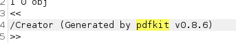

# Precious

## Enumeration

```bash
nmap -T4 -p- 10.129.80.85
```

* Ports found

```
PORT      STATE    SERVICE
22/tcp    open     ssh
80/tcp    open     http
```


## HTTP server


To make the website work I had to add the IP into hosts file

echo "10.129.80.85 precious.htb" >> /etc/hosts


<figure><figcaption></figcaption></figure>

* Launch a self-hosted web server in the attacker machine to intercept and intercept the request with burp

```python
python3 -m http.server 80
```


Intercept traffic and send to repeater

<figure><figcaption></figcaption></figure>

With the repeater option we can identify interesting things in the response

<figure><figcaption></figcaption></figure>

The most prominent is related to WKHTMLTOPDF, and with a quick google we can find several exploits to it, however, none of them worked.&#x20;


### Other possible vulnerable services

<figure><figcaption></figcaption></figure>


TO BE CONTINUED ....


